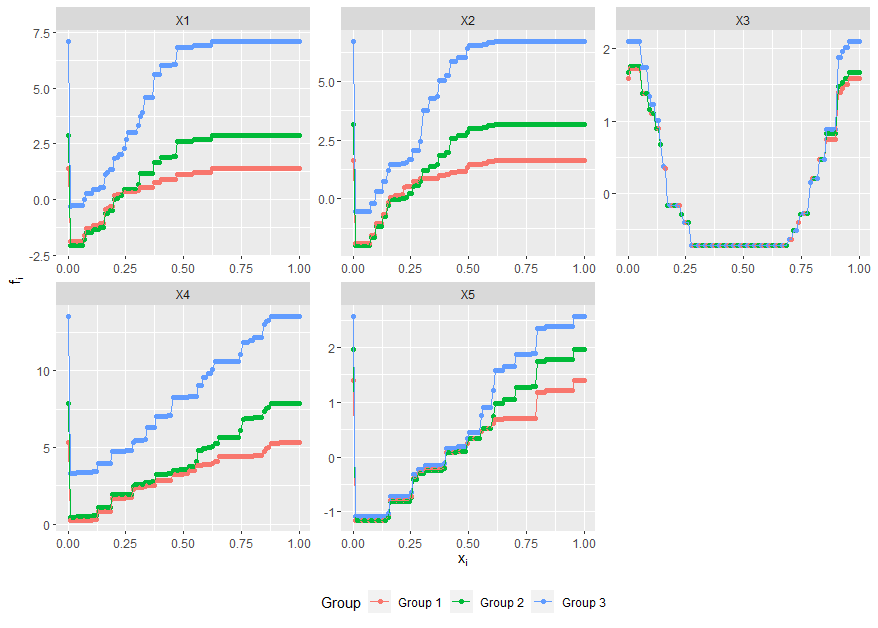

# LitBoost
Locally Interpretable Tree Boosting (**LitBoost**) is a tree boosting method that is tailored for problems where the data set consists of several known categories, for instance city cistricts in a house price prediction scenario. By using interaction constraints in Graident Boosted Trees (GBT), for instance XGBoost ([Chen & Guestrin (2016)](https://arxiv.org/pdf/1603.02754.pdf)), we are able to create a set of jointly trained local models that inherit the interpretability benefits of a Generalized Additive Model, while achieiving prediction accuracy that is close to that of the state-of-the-art GBT in scenarios where we have multiple groups with few observations per group.

# Vignette
A working example can be found in in the file ```litboost_vignette.R```. First we generate data according to the process described in our paper: 
``` r
library(xgboost)
library(DiagrammeR)
library(mltools)
library(tidyverse)
library(dplyr)

source("helper_functions.R")

# Simulate data 
friedman_data = SimulateData(N = 1000, K = 3, sigma = 0.1)
sim_data = friedman_data$sim_data
df = friedman_data$df


# Split into train and test
N = NROW(df)
ind = sample(x = 1:N, size = floor(0.5*N), replace = FALSE)
train_df = df[ind,]
test_df = df[-ind,]
```
Train a LitBoost model: 


``` r
model_formula = formula(paste("y ~", paste(names(df[,-1]), collapse = "+")))

# Run LitBoost 
litboost_model = litboost.train(train_df = df, model_formula = model_formula)
litboost_preds = litboost.predict(model = litboost_model, test_df = test_df, model_formula = model_formula)
```
Access the shape functions in order to get a fully interpretable model: 
``` r
shape_functions = GetShapeFunctions(model = litboost_model,
                                    formula = model_formula, 
                                    train_df = train_df, 
                                    variables = c("X1", "X3"))
```
An example of the resulting shape functions: 



# Citation
Please cite our paper if this work interests you: 

```
@misc{LitBoost,
  title={Locally Interprtable Tree Boosting: An Application to House Price Prediction},
  author={Hjort, Anders and Sommervoll, Dag Einar and Scheel, Ida and Pensar, Johan},
  year={2023}
}
```
ArXiv link coming soon! 


